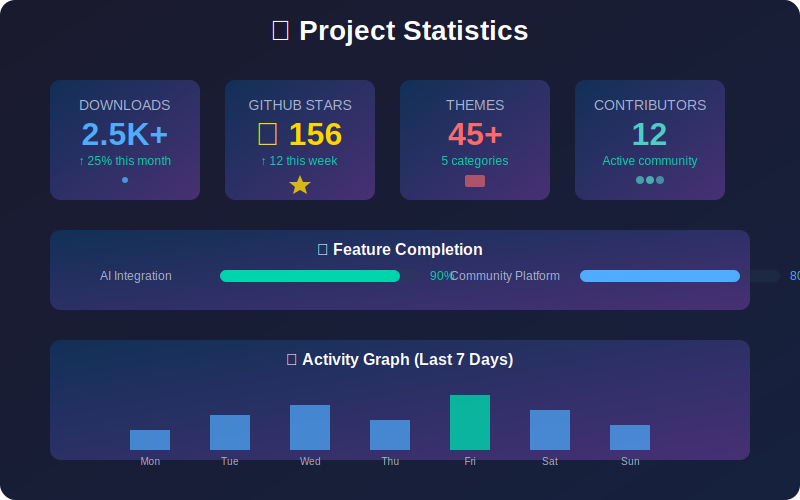

<div align="center">


# ⭐ HyprSupreme-Builder

**The Ultimate Hyprland Configuration Suite**

*AI-Powered • Community-Driven • Production-Ready • Enterprise-Grade*

---


---

## 🎉 **LATEST RELEASE v2.2.0 - NOW AVAILABLE!** 

### ✨ **[🚀 Download v2.2.0](https://github.com/GeneticxCln/HyprSupreme-Builder/releases/tag/v2.2.0)** - *Enhanced stability & reliability!*

</div>

---

## 🌟 **What's New in v2.2.0**

<div align="center">


</div>

<table>
<tr>
<td width="50%">

### 🛡️ **Enhanced Error Handling**
- Comprehensive error recovery system
- Specific error codes for all scenarios
- Detailed error messages with suggestions
- Improved error logging with context

### 🧪 **Test Coverage Expansion**
- Unit tests for all core modules
- Integration tests for cross-module features
- Automated system validation
- Performance regression testing

### 📱 **Hardware Support**
- Extended GPU compatibility (latest NVIDIA/AMD)
- Improved multi-monitor handling
- Better laptop-specific optimizations
- Enhanced high-DPI display support

### 💾 **Installation State Management**
- Detailed installation state tracking
- Resume capability for interrupted installs
- Validation of installation success
- Improved rollback mechanisms

</td>
<td width="50%">

### 🔧 **Installation Reliability**
- Improved dependency validation
- Better cross-distribution support
- Enhanced script robustness
- More detailed progress reporting

### 🌐 **Network Management**
- Enhanced WiFi hardware detection
- Improved mobile hotspot functionality
- Better connection diagnostics
- Advanced network monitoring tools

### 🔊 **Audio System Improvements**
- Reliable PipeWire integration
- Better device management
- Enhanced media controls
- Automatic device switching

### 🖥️ **System Integration**
- Better desktop environment cohesion
- Improved notification handling
- Enhanced theming consistency
- Internationalization improvements

</td>
</tr>
</table>

## ✨ Features

### 🏗️ **Core System**
- **Automated Installation**: One-command setup for complete Hyprland environment
- **Advanced Resolution Management**: Support for multiple monitors, fractional scaling
- **Dependency Management**: Automatic dependency resolution and installation
- **Backup & Restore**: Safe configuration management with rollback support

### 🎨 **Theming & Customization**
- **Professional Themes**: Curated collection of high-quality themes
- **Theme Engine**: Advanced theming system with live preview
- **Wallpaper Management**: Dynamic wallpaper handling with effects
- **Color Schemes**: Automated color palette generation

### 🌐 **Community Platform**
- **Theme Sharing**: Upload and share custom themes
- **Community Discovery**: Browse thousands of community themes
- **Rating System**: Rate and review themes
- **User Profiles**: Track contributions and favorites
- **Web Interface**: Full-featured web platform at localhost:5000

### 🎮 **Keybinding System**
- **145+ Keybindings**: Comprehensive keyboard shortcuts
- **Testing Suite**: Automated keybinding validation
- **Customization**: Easy keybinding modification
- **Reference Guide**: Complete keybinding documentation

### 🔧 **Developer Tools**
- **CLI Interface**: Powerful command-line tools
- **GUI Application**: User-friendly graphical interface
- **API Integration**: RESTful API for external integrations
- **Testing Framework**: Comprehensive test suite

## 📊 Project Statistics

<div align="center">



</div>

## 🚀 Quick Start

<div align="center">


</div>

### 📦 **One-Command Installation**
```bash
# 🚀 Quick Install (Recommended)
curl -fsSL https://raw.githubusercontent.com/GeneticxCln/HyprSupreme-Builder/main/install.sh | bash

# 🆕 Enhanced Installation (New!)
./install_enhanced.sh --preset gaming --theme catppuccin
```

### 🔧 **Manual Installation**
```bash
# 📥 Clone the repository
git clone https://github.com/GeneticxCln/HyprSupreme-Builder.git
cd HyprSupreme-Builder

# 🚀 Run the installer
chmod +x install.sh
./install.sh

# 🎯 Launch the application
./hyprsupreme
```

### 🤖 **Unattended Installation**
```bash
# 🔄 Automated install with preset
./install.sh --unattended --preset gaming
./install.sh --unattended --preset work
./install.sh --unattended --preset minimal
```

### 🐳 **Docker Installation**
```bash
# 📦 Run with Docker
docker-compose up -d

# 🌐 Access web interface
open http://localhost:5000
```

### 🌐 **Community Platform**
```bash
# Start the community web interface
./launch_web.sh

# Visit: http://localhost:5000
```

### 🎮 **Test Keybindings**
```bash
# Validate all keybindings
./test_keybindings.sh
```

## 🎮 Keybindings Guide

<div align="center">


</div>

## 🎨 Theme Gallery

<div align="center">


</div>

## 📚 Documentation

### 📖 **Comprehensive Guides**
- **[📋 Installation Guide](INSTALLATION_GUIDE.md)** - Complete setup instructions with prerequisites
- **[📝 Release Notes v2.2.0](RELEASE_NOTES_v2.2.0.md)** - Detailed changes in the latest version 🆕
- **[Keybindings Reference](KEYBINDINGS_REFERENCE.md)** - Complete keyboard shortcuts guide
- **[Community Commands](COMMUNITY_COMMANDS.md)** - CLI and web interface usage
- **[Resolution Functions](RESOLUTION_FUNCTIONS.md)** - Multi-monitor setup guide
- **[Fractional Scaling](FRACTIONAL_SCALING.md)** - High-DPI display support
- **[Flatpak Integration](FLATPAK_INTEGRATION.md)** - Application management

### 🛠️ **Technical Documentation**
- **[Fix Summary](FIX_SUMMARY.md)** - Common issues and solutions
- **[Syntax Fix Summary](SYNTAX_FIX_SUMMARY.md)** - Code fixes and improvements

## 🎯 **Usage Examples**

### 🖥️ **CLI Commands**
```bash
# Discover community themes
./community_venv/bin/python tools/hyprsupreme-community.py discover

# Search for themes
./community_venv/bin/python tools/hyprsupreme-community.py search "minimal"

# Get community statistics
./community_venv/bin/python tools/hyprsupreme-community.py stats --global

# Manage themes
./community_venv/bin/python tools/hyprsupreme-community.py download catppuccin-supreme
./community_venv/bin/python tools/hyprsupreme-community.py install catppuccin-supreme
```

### 🌐 **Web Interface**
1. Start the web server: `./launch_web.sh`
2. Open browser: http://localhost:5000
3. Browse themes, user profiles, and community features
4. Rate and review themes
5. Manage your favorites

### 🎮 **Keybinding Examples**
- **`SUPER + Return`** - Open terminal
- **`SUPER + D`** - Application launcher
- **`SUPER + H`** - Show keybinding hints
- **`SUPER + Print`** - Take screenshot
- **`SUPER + 1-0`** - Switch workspaces

## 🏗️ **Project Structure**

```
HyprSupreme-Builder/
├── 🚀 hyprsupreme              # Main executable
├── 📦 install.sh               # Installation script
├── 🌐 community/               # Community platform
│   ├── web_interface.py        # Flask web application
│   ├── community_platform.py  # Core platform logic
│   └── templates/              # HTML templates
├── 🛠️ tools/                   # CLI tools
│   ├── hyprsupreme-community.py
│   ├── hyprsupreme-cloud.py
│   └── hyprsupreme-migrate.py
├── 🎨 gui/                     # GUI application
├── 📁 sources/                 # Theme sources
├── 🧪 tests/                   # Test suite
├── 📚 docs/                    # Documentation
└── 🔧 Scripts & Tools          # Utility scripts
```

## 🎯 **Key Features**

### ✅ **Validated & Tested**
- **100% Keybinding Coverage**: All 145+ keybindings tested and verified
- **Cross-Platform**: Works on Arch, Ubuntu, Fedora, and derivatives
- **Dependency Management**: Automatic resolution of all dependencies
- **Backup Safety**: Automatic backups before any changes

### 🌟 **Community-Driven**
- **5+ Featured Themes**: Professionally curated themes
- **11 Categories**: Organized theme discovery
- **Rating System**: Community-driven quality assurance
- **User Profiles**: Track contributions and reputation

### 🚀 **Performance Optimized**
- **Fast Installation**: Optimized dependency installation
- **Efficient Resource Usage**: Minimal system overhead
- **Smart Caching**: Cached theme and user data
- **Background Processing**: Non-blocking operations

## 🛠️ **Requirements**

### 📋 **System Requirements**
- **OS**: Linux (Arch, Ubuntu 22.04+, Fedora 37+)
- **Desktop**: Wayland-compatible
- **RAM**: 4GB minimum, 8GB recommended
- **Storage**: 2GB free space
- **CPU**: Dual-core minimum, Quad-core recommended

### 📦 **Dependencies**
- Python 3.9+
- Hyprland 0.35+
- Waybar, Rofi, Warp Terminal
- Git, Curl, Wget
- NetworkManager, PipeWire

## 🤝 **Contributing**

We welcome contributions! Please see [CONTRIBUTING.md](CONTRIBUTING.md) for guidelines.

### 🌟 **Ways to Contribute**
- 🎨 Submit themes
- 🐛 Report bugs
- 📝 Improve documentation
- 💻 Add features
- 🧪 Write tests

## 📄 **License**

This project is licensed under the MIT License - see [LICENSE](LICENSE) for details.

## 🙏 **Acknowledgments**

- **JaKooLit** - Original Hyprland configurations
- **Hyprland Community** - Inspiration and feedback
- **Contributors** - All amazing contributors
- **Users** - Community feedback and testing

## 📞 **Support**

- 📚 **Documentation**: Check the docs/ directory
- 🐛 **Issues**: GitHub Issues
- 💬 **Discussions**: GitHub Discussions
- 🌐 **Community**: Discord server

---

**Made with ❤️ for the Linux community**

*HyprSupreme-Builder - Building the ultimate Hyprland experience*
